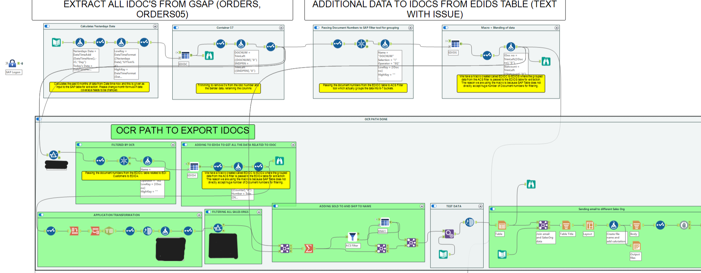

# 🌀 Alteryx Workflow – Automated Data Preparation & Distribution

This workflow is designed to **automatically extract, clean, transform, and distribute data** to different business teams. It is deployed on **Alteryx Server** and scheduled to run **daily**.

---

## 📌 What It Does

- 📥 **Extracts data** from multiple **GSAP tables**
- 🧹 **Cleans and prepares** the data to resolve:
  - Missing or null values
  - Inconsistent formatting
  - Duplicates or irrelevant records
- 🔗 **Joins data** from various GSAP sources and applies transformation logic
- 📨 **Sends automated emails** with tailored datasets:
  - Each team receives a different output depending on `Group By` values
  - Fully dynamic filtering and file generation per team
- 🔁 **Hosted on Alteryx Server** and scheduled to run **daily**

---

## ✅ Key Benefits

- Internal teams **no longer need to manually extract or filter data**
- Each team **receives a ready-to-use report** with only the data they need
- Reports include **clear next actions**, customized per recipient
- Saves significant time and reduces manual errors

---

## 📸 Workflow Screenshot

> `.yxmd` file is not included for confidentiality. This repository serves as a portfolio showcase of the solution's logic.

---

## 🛠️ Tools Used

- **Alteryx Designer**
- **Alteryx Server (Scheduler)**
- **GSAP Table Inputs**
- Core tools: `Input Data`, `Join`, `Filter`, `Formula`, `Output Data`, `Email`
