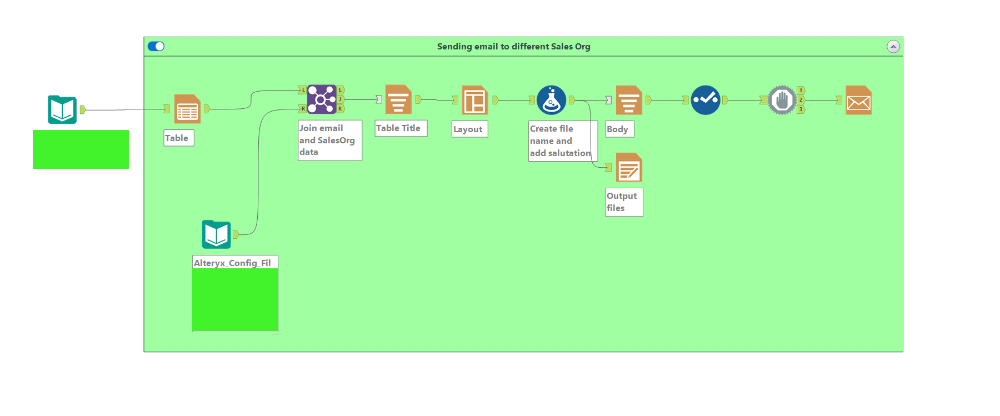

# 🌀 Alteryx Workflow Suite – Scalable Data Automation with Dynamic Execution

This Alteryx-based automation suite is designed to **extract, transform, and distribute data from GSAP systems** using a highly **dynamic, configurable execution logic** hosted on **Alteryx Server**. It includes **error handling**, **logging**, and **targeted distribution** via email.

---

## 🚀 Overview

The solution consists of **four modular workflows** managed through a **central execution controller**. This modular approach allows easy maintenance and flexible deployment while enabling dynamic configuration via an Excel-based setup.

---

## ⚙️ Architecture Highlights

### 🔄 1. Central Execution Workflow (List Runner)
- **Purpose**: Controls execution of all other workflows.
- **Features**:
  - **Runs on Alteryx Server** as the only published workflow.
  - **Reads from Excel configuration** to determine which workflows to execute.
  - Executes child workflows from a folder structure, enabling updates without republishing to the server.
  - Built-in **error handling**:
    - Logs all workflow results (success/failure).
    - If any workflow fails, a **log file is emailed to the developer** automatically.

📸 _Screenshot placeholder: Execution Workflow_  

---

### 📊 2. Data Preparation Workflow – Part 1 (General GSAP Extraction)
- **Purpose**: Extracts and blends data from multiple GSAP tables.
- **Key Functions**:
  - Joins and blends multiple sources.
  - Applies cleansing rules: null handling, formatting, deduplication.
  - Prepares unified dataset for export to the database.

📸 _Screenshot placeholder: Part 1 Workflow_  

---

### 🧪 3. Data Preparation Workflow – Part 2 (Advanced Transformation)
- **Purpose**: Focused GSAP data extraction with advanced logic.
- **Key Features**:
  - Uses the **Python tool in Alteryx** for:
    - Custom column creation.
    - Data masking and transformation with **pandas**.
  - Outputs refined data into the target database.

📸 _Screenshot placeholder: Part 2 Workflow_  

---

### 📧 4. Email Distribution Workflow
- **Purpose**: Sends personalized reports to target recipients.
- **Highlights**:
  - Driven by the Excel configuration file.
  - Emails are grouped and filtered dynamically (e.g., by team, region).
  - Each team receives **only the data relevant to their scope**.

📸 _Screenshot placeholder: Email Workflow_  

---

## 📁 Configuration

- **Excel-based configuration file** defines:
  - Which workflows to run (`Yes/No` flags).
  - Dynamic email recipients and grouping criteria.
- Easy to modify without altering Alteryx workflows or republishing.

---

## ✅ Key Benefits

- **Centralized control** with modular architecture.
- **Low-maintenance deployment** – only the execution controller is hosted on Alteryx Server.
- **Flexible configuration** using a simple Excel file.
- **Built-in error handling and alerting** for robust monitoring.
- **Targeted distribution** of data to appropriate teams.
- Scalable and adaptable to new workflows or business logic changes.

---

## 🛠️ Tools & Technologies

- **Alteryx Designer**
- **Alteryx Server (Scheduler + Gallery)**
- **SAP/GSAP Connectors**
- **Python (via Alteryx Python Tool)**
- Alteryx tools used: `Input Data`, `Join`, `Formula`, `Filter`, `Output Data`, `Email`, `Run Command`, `Log`, `Python`, and more.

---

## 📁 Repository Info

> This repository showcases the **logic, structure, and capabilities** of the automation. `.yxmd` files are not included due to data sensitivity. All screenshots and explanations represent actual implementation.
